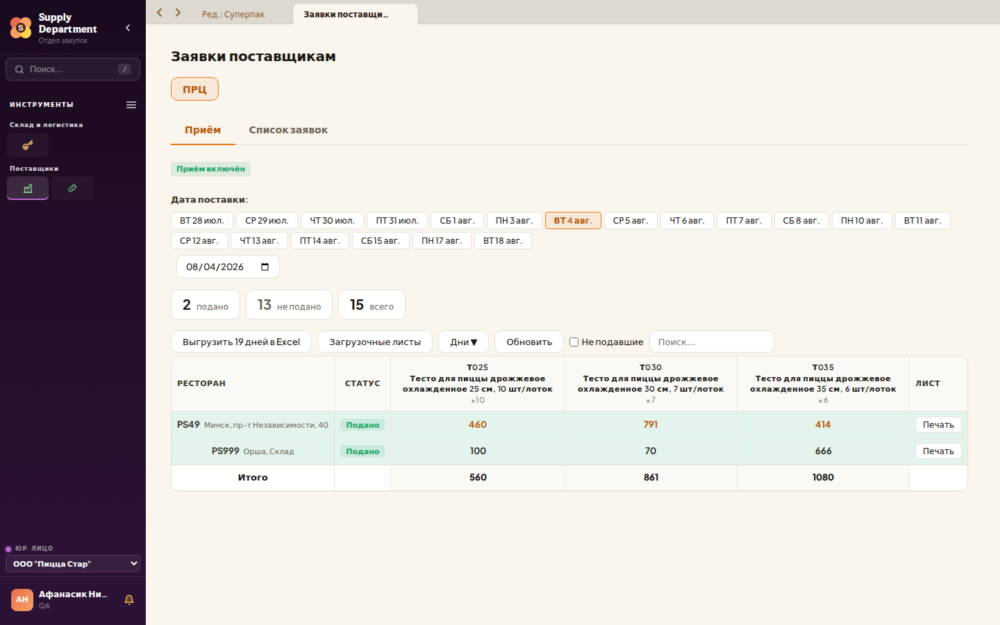
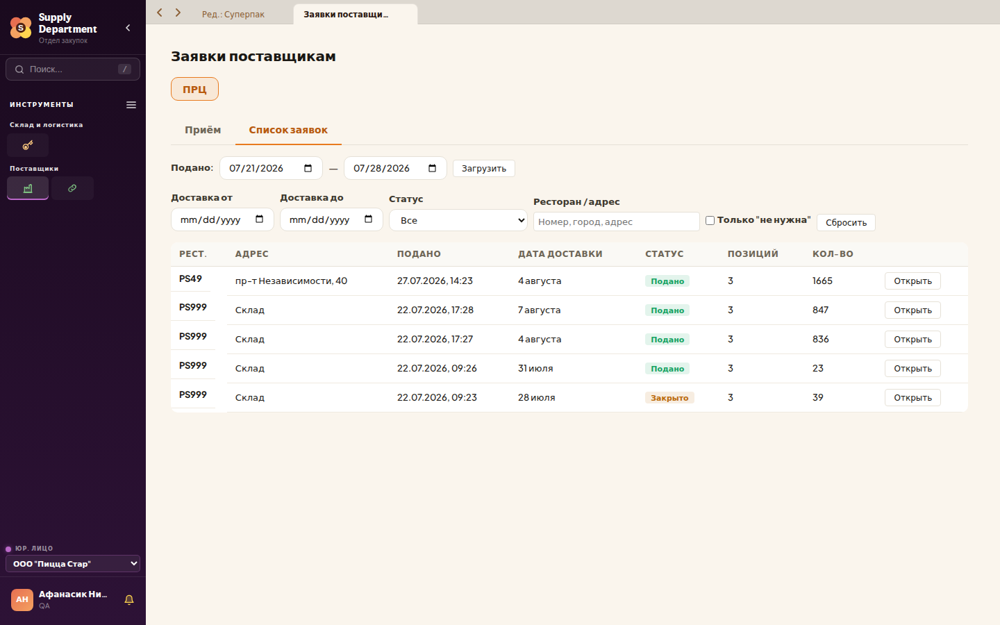

# Портал закупок для ПРЦ

### Как смотреть заявки ресторанов на тесто
Инструкция для сотрудников производственного центра

---

## 1. Зачем вам портал

Рестораны Пицца Стар подают заявки на тесто через портал закупок. Раньше вы видели
их только в письме и в файле. Теперь можно зайти на портал и посмотреть заявки
в любой момент: до дедлайна, после дедлайна, за любой день вперёд.

На портале вы можете:

- видеть, кто из ресторанов подал заявку, а кто ещё нет;
- смотреть количество теста по каждому размеру и итог за день;
- скачать заявку в Excel — за день или сразу за все дни вперёд;
- скачать и распечатать загрузочные листы (раскладку по стопкам).

Изменить что-либо в заявке через портал нельзя — это делает отдел закупок.

---

## 2. Вход

1. Откройте **supply-department.online**
2. Вкладка **«Отдел закупок»**, вводите свою рабочую почту (@dodopizza.by) и пароль.
3. Пароль выдаёт отдел закупок. Если не помните — «Забыли пароль?» на странице входа.

Заходите под своей учётной записью, не под чужой: в портале видно, кто что делал.

---

## 3. Что вы видите

Вам открыт **один раздел — «Заявки поставщикам»**, и в нём **только ПРЦ**.
Заявки другим поставщикам Пицца Стар вам не показываются.

Внутри раздела две вкладки:

| Вкладка | Для чего |
|---|---|
| **Приём** | Главный экран: заявки на выбранный день и выгрузки |
| **Список заявок** | Все заявки за период, если нужно найти конкретную |

---

## 4. Вкладка «Приём» — основной экран

Читается сверху вниз:

- **Дата поставки** — ряд кнопок с датами. Нажали на дату — таблица показывает
  заявки именно на этот день.
- **Три счётчика** — сколько ресторанов подало заявку, сколько нет, сколько всего
  ожидается в этот день.
- **Таблица** — строка на ресторан. Слева номер и адрес, дальше статус,
  затем количество по каждому размеру теста в штуках, справа — кнопка **«Печать»**.
- **Итого** внизу — общее количество по каждому размеру за день. По этой строке
  удобно сверять объём производства.

**Статусы в таблице**

| Статус | Что значит |
|---|---|
| **Подано** | Ресторан отправил заявку |
| **Закрыто** | Дедлайн прошёл, заявку уже не изменят |
| пусто | Ресторан ещё не подал заявку |

---

## 5. Кнопки выгрузки

- **«Выгрузить N дней в Excel»** — заявки сразу за все ближайшие дни, одним файлом.
  Удобно для планирования смен.
- **«Загрузочные листы»** — тот самый файл с раскладкой по стопкам: по листу на
  каждую стопку, первый лист — навигация. Формируется за выбранный день.
- **«Дни»** — выбрать, какие именно дни попадут в выгрузку.
- **«Обновить»** — перечитать данные, если ресторан подал заявку только что.
- **«Печать»** в строке ресторана — загрузочные листы одного ресторана, сразу на
  печать из браузера.

Как читать загрузочные листы — в отдельной инструкции «Загрузочные листы ПРЦ».

---

## 6. Вкладка «Список заявок»

Нужна, когда ищете конкретную заявку, а не день целиком.

- сверху выбираете период **по дате подачи**, ниже — фильтры по **дате доставки**,
  статусу и ресторану;
- в строке видно, когда заявка подана, на какое число, сколько позиций и общее
  количество;
- **«Открыть»** — посмотреть заявку целиком, по позициям.

---

## 7. Порядок работы в обычный день

1. Открыть портал, вкладка **«Приём»**.
2. Выбрать дату отгрузки.
3. Посмотреть счётчики: все ли рестораны подали заявку.
4. Дождаться дедлайна (время указано в письме и в графике поставок).
5. Скачать **«Загрузочные листы»** за этот день.
6. Распечатать и собирать стопки по листам.

Если ресторан подал заявку после того, как вы скачали файл, — нажмите
**«Обновить»** и скачайте листы заново. Работать нужно по последней версии.

---

## 8. Частые вопросы

**Я вижу только ПРЦ. Где остальные поставщики?**
Так и задумано: вам открыты только ваши заявки.

**Могу ли я поправить количество в заявке?**
Нет. Изменения вносит отдел закупок или сам ресторан до дедлайна.
Если видите ошибку — напишите в отдел закупок.

**В таблице пусто, хотя день рабочий.**
Проверьте выбранную дату и снимите галочку «Не подавшие» — она показывает только
тех, кто ещё не подал заявку.

**Цифры в портале и в письме отличаются.**
Портал показывает текущее состояние, письмо — состояние на момент отправки.
Верно то, что в портале, но после дедлайна они совпадают.

**Не открывается страница или не подходит пароль.**
Напишите в отдел закупок — восстановим доступ.

---

## 9. Куда обращаться

По заявкам, дедлайнам и доступу к порталу — отдел закупок Burger King / Пицца Стар.
