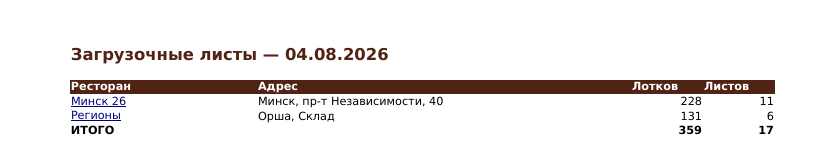
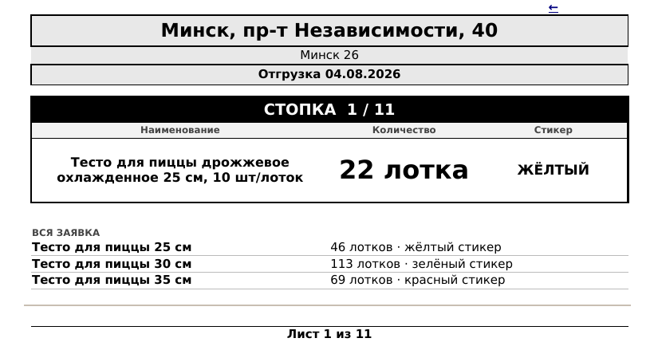
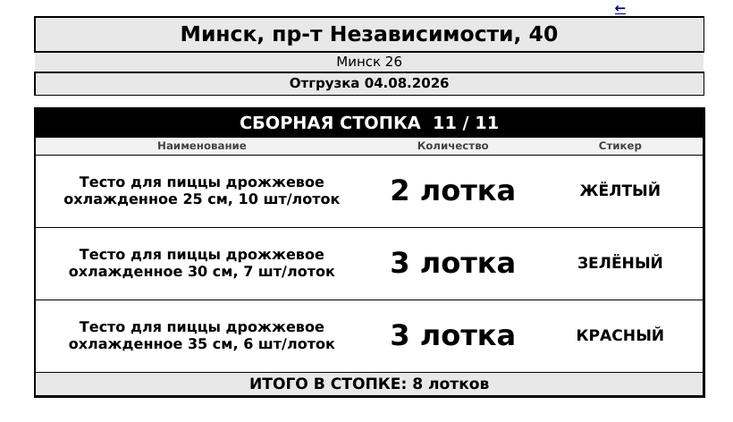

# Загрузочные листы ПРЦ

### Инструкция для сотрудников производственного центра
Как читать заявку на тесто и собирать стопки по загрузочным листам

---

## 1. Что приходит на почту

Накануне отгрузки отдел закупок присылает письмо с **двумя файлами**:

| Файл | Что внутри | Для чего |
|---|---|---|
| **Заявка** | Сколько теста заказал каждый ресторан, в штуках | Для сверки |
| **Загрузочный лист — ДД.ММ.ГГГГ** | То же самое, разложенное по стопкам | **Работаем по нему** |

Считать самим ничего не нужно: в загрузочном листе уже посчитаны лотки и стопки.

---

## 2. Три правила, по которым построен файл

1. **В лотке фиксированное число заготовок:** 25 см — 10 шт, 30 см — 7 шт, 35 см — 6 шт.
2. **В стопке ровно 22 лотка.** Стопка — это четверть паллеты, больше не кладём.
3. **Сначала «чистые» стопки одного размера**, остаток всех размеров — в **сборную** стопку.

**Пример.** Ресторан заказал 460 заготовок теста 25 см.
460 ÷ 10 = **46 лотков** → 2 полные стопки (44 лотка) и **2 лотка в остаток**.
Остатки по всем размерам собираются вместе в сборную стопку в конце.

---

## 3. Первая страница — навигация

Файл открывается на листе **«Навигация»**: это оглавление на весь день.

- **Ресторан** — регион и номер точки в ДОДО ИС. Это **ссылка**: нажмите — откроется лист ресторана.
- **Лотков** и **Листов** — объём по этому ресторану: сколько лотков и сколько стопок (страниц) печатать.
- **ИТОГО** внизу — общий объём за день.

С любого листа можно вернуться сюда — в правом верхнем углу стоит стрелка **←**.

---

## 4. Обычная стопка

У каждого ресторана свой лист, а внутри — по странице на каждую стопку.

Читается сверху вниз:

- в шапке крупно **адрес** (по нему ориентируется водитель), под ним номер в ДОДО ИС и дата отгрузки;
- чёрная полоса — какая это стопка по счёту: **СТОПКА 1 / 11**;
- таблица: **наименование, количество лотков, цвет стикера** — это и кладём в стопку;
- **ВСЯ ЗАЯВКА** — весь заказ ресторана целиком, чтобы видеть картину;
- в самом низу — **Лист 1 из 11**.

Собрали стопку — кладём распечатанный лист сверху или клеим сбоку.

---

## 5. Сборная стопка

Последняя стопка ресторана обычно сборная: в ней остатки разных размеров.

Отличия от обычной:

- в чёрной полосе написано **СБОРНАЯ СТОПКА**;
- в таблице несколько строк — по строке на каждый размер теста;
- **стикер свой у каждой строки**, смотрите построчно;
- внизу серая полоса **ИТОГО В СТОПКЕ** — сколько лотков всего.

В примере: 2 лотка 25 см + 3 лотка 30 см + 3 лотка 35 см = **8 лотков**.
Такая стопка неполная — это нормально, она закрывает остатки.

---

## 6. Стикеры

| Размер теста | Стикер |
|---|---|
| 25 см | **ЖЁЛТЫЙ** |
| 30 см | **ЗЕЛЁНЫЙ** |
| 35 см | **КРАСНЫЙ** |

Цвет написан словом: листы печатаются на чёрно-белом принтере, по картинке цвет не понять.

---

## 7. Порядок работы

1. Открыть файл, посмотреть на «Навигации» объём дня.
2. Распечатать листы — каждая страница это одна стопка, печатаются все.
3. Собрать стопку по своей странице: наименование, количество лотков, стикер.
4. Положить лист на стопку.
5. Перейти к следующей странице ресторана, пока не закроются все стопки.
6. Взять следующий ресторан по навигации.

---

## 8. Частые вопросы

**Стопка получилась неполная — так и должно быть?**
Да, если это последняя (сборная) стопка ресторана. Остальные всегда по 22 лотка.

**В файле нет ресторана, который обычно заказывает.**
На эту дату он не подал заявку — в файл попадают только те, у кого есть заказ.

**Количество лотков не сходится с моим расчётом.**
Проверьте, сколько штук в лотке для размера (25 см — 10, 30 см — 7, 35 см — 6).
Неполный лоток округляется вверх до целого.

**Прислали новый файл на ту же дату.**
Работаем по последнему письму: заявка изменилась, старые распечатки выбрасываем.

**Не открывается файл или не пришло письмо.**
Напишите в отдел закупок — вышлют повторно.
